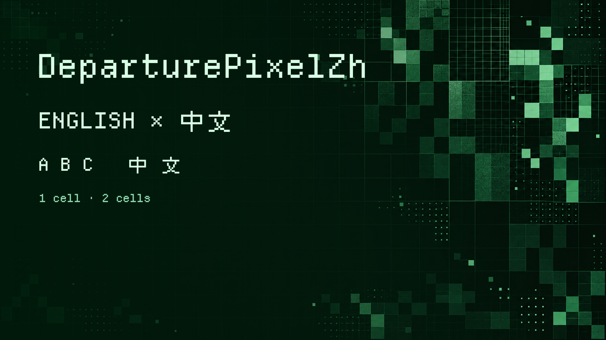

# DeparturePixelZh

[English](README.md) · [简体中文](README.zh-Hans.md) · [日本語](README.ja.md) · [한국어](README.ko.md) · [Español](README.es.md)

Letras inglesas y caracteres chinos de estilo píxel en una sola fuente monoespaciada. Los caracteres latinos ocupan una celda; los caracteres chinos de ancho completo, dos. Incluye iconos para desarrolladores. Los emoji en color usan la fuente del sistema.

[Descargar DeparturePixelZh 0.1.0 (ZIP)](https://github.com/codingEzio/DeparturePixelZh/releases/download/v0.1.0/DeparturePixelZh-0.1.0.zip) · [Todas las versiones](https://github.com/codingEzio/DeparturePixelZh/releases)



Combina [Departure Mono](https://github.com/rektdeckard/departure-mono), [Cubic 11](https://github.com/ACh-K/Cubic-11) y Nerd Fonts Symbols Mono.

## Elegir una fuente

| Familia | Nombre PostScript | Espaciado |
| --- | --- | --- |
| DeparturePixelZh | `DeparturePixelZh-Regular` | Estándar |
| DeparturePixelZh Compact | `DeparturePixelZhCompact-Regular` | Un 7,14% más estrecho |

Ambas son fuentes Regular, sin cursiva y con la misma altura de línea. Compact ya adapta las formas y el espaciado; no hace falta cambiar el espaciado en la aplicación.

## Uso

Instala el TTF en el escritorio y usa WOFF2 en la web. Los paquetes incluyen las fuentes, sumas de comprobación, registros de origen y avisos de licencia. Conserva `OFL.txt`, `NOTICE.md` y `licenses/` al redistribuir las fuentes o incluirlas en una aplicación.

Las aplicaciones de Apple que registren una fuente incluida deben usar su nombre PostScript exacto. En la web, carga el WOFF2 sin una fuente `local()` y conserva una alternativa del sistema.

## Reconstruir

Necesitas [uv](https://docs.astral.sh/uv/) y DeparturePixelZhBuilder en un directorio hermano. Usa la revisión indicada en [builder-version](builder-version). La comprobación de publicación exige esa revisión exacta y un árbol de trabajo sin cambios.

```sh
cd ../DeparturePixelZhBuilder
uv run departurepixelzh-builder build --recipe ../DeparturePixelZh/recipe.json --output ../DeparturePixelZh/Build
uv run departurepixelzh-builder check --recipe ../DeparturePixelZh/recipe.json --output ../DeparturePixelZh/Build
```

En macOS, ejecuta `swift scripts/check_native.swift Build` desde este repositorio para comprobar las fuentes con el sistema nativo. Usa `--development` solo para desarrollar el constructor localmente: omite la revisión fijada y no permite generar una versión candidata para publicación.

[recipe.json](recipe.json) fija las URL de origen y los valores SHA-256. El constructor descarga los archivos desde esas URL o reutiliza copias en caché, y los valida con los valores fijados. Nunca lee fuentes instaladas en macOS como entrada de compilación. [consumer-fixture/](consumer-fixture/) muestra cómo copiar fuentes verificadas, avisos y registros de origen a un proyecto que las use.

## Cobertura y límites

Departure Mono tiene prioridad cuando las fuentes comparten un carácter. Cubic 11 completa la cobertura china y Nerd Fonts Symbols Mono aporta los iconos de uso privado. Los archivos de cobertura generados indican el origen de cada punto de código incluido.

Solo se ofrecen estilos Regular sin cursiva. Los caracteres no incluidos y los emoji en color necesitan fuentes alternativas. El aspecto depende del tamaño, la escala de pantalla y la aplicación. El proyecto no afirma haber verificado la representación en todas las plataformas.

## Opcional: comparar las fuentes originales

En macOS con Homebrew, puedes instalar las fuentes originales para comparar su aspecto. No es un requisito de compilación ni hace falta para instalar o usar DeparturePixelZh.

```sh
brew install --cask font-departure-mono font-cubic-11
```

## Licencia

Las fuentes usan la [SIL Open Font License 1.1](OFL.txt). Consulta [NOTICE.md](NOTICE.md) y [licenses/](licenses/) para conocer la atribución, los cambios, los nombres reservados y las condiciones de cada componente. DeparturePixelZh es un nombre derivado independiente; no implica el respaldo de los autores originales ni de los titulares de marcas.
